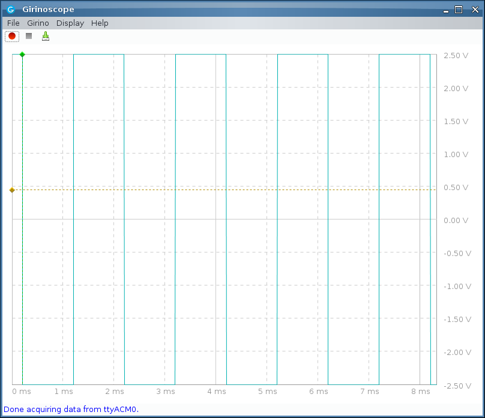

## Girinoscope ported to STM32duino (libmaple core) stm32f103 maple mini or blue pill

This is a port of Girinoscope arduino implementation to STM32duino (libmaple core) for stm32f103 maple mini or blue pill

### References / credits
- [Girino instructable](https://www.instructables.com/id/Girino-Fast-Arduino-Oscilloscope/) 
- [Girinoscope java app github](https://github.com/Chatanga/Girinoscope)
- [original arduino girino firmware github](https://github.com/supacyan/girino)
- [STM32duino libmaple core github](https://github.com/rogerclarkmelbourne/Arduino_STM32)

### Build

- build the sketch GirinoSTM32F103maplemini.ino using the 
[arduino IDE](https://www.arduino.cc/en/Main/Software)
- the core needs to be [STM32duino libmaple core](https://github.com/rogerclarkmelbourne/Arduino_STM32) 
- and for the [maple mini board](https://wiki.stm32duino.com/index.php?title=Maple_Mini)  
[leaflabs](https://www.leaflabs.com/maple) 
[maple mini on leaflabs](http://docs.leaflabs.com/static.leaflabs.com/pub/leaflabs/maple-docs/0.0.12/hardware/maple-mini.html)
- or blue pill (STM32F103 generic board)


### Use

- The ADC (oscilloscope) input is from pin PA0 ADC 1 channel 0 (max 3.3v)  
- Timer 2 is setup on PA1 to generate a 1khz signal, hence you could 
patch PA1 to PA0 for a test signal
- The call to setup timer 2 is in setup(), comment the call to initTesttimer() if it is not required  
```
	// setup timer 2 to generate test signals, comment this if not required  
	initTesttimer();
```
- For now this is a 'Girino compatible' release:  
  * i.e. 8 bits signals (yup stm32f103 can do 12 bits), but java frondend is for 8 bits data x 1280 samples per frame. the higher order 8 bits is sent  
  * there is no comparator on stm32f103c{8,b}, signal triggering is done in software
  * sample rates are made to conform to girino (frontend) sample rates 
- Currently this is a very draft release (just about works, and i'm not sure if anything is incorrect). 
- stm32f103 is possibly capable of much higher sample rates, those features are currently not implemented, the codes (for now) is made simple and based on software polling the ADC after the software receive a timer interrupt. with this approach, there are real limits to how far sampling can go
- it interfaces over usb-serial, hence
  * first connect the maple mini with Girino stm32duino flashed/installed
  * then start the java [Girinoscope front end](https://github.com/Chatanga/Girinoscope) and connect to it


