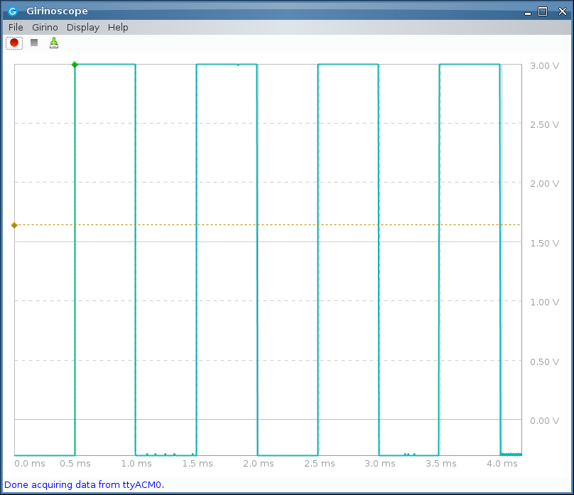

## Girinoscope ported to STM32duino (libmaple core) stm32f103 maple mini or blue pill

This is a port of Girinoscope arduino implementation to STM32duino (libmaple core) for stm32f103 maple mini or blue pill

### References / credits
- [Girino instructable](https://www.instructables.com/id/Girino-Fast-Arduino-Oscilloscope/) 
- [Girinoscope java app github](https://github.com/Chatanga/Girinoscope)
- [original arduino girino firmware github](https://github.com/supacyan/girino)
- [STM32duino libmaple core github](https://github.com/rogerclarkmelbourne/Arduino_STM32)

### Build

- build the sketch GirinoSTM32F103maplemini.ino using the 
[arduino IDE](https://www.arduino.cc/en/Main/Software)
- the core needs to be [STM32duino libmaple core](https://github.com/rogerclarkmelbourne/Arduino_STM32) 
- and for the [maple mini board](https://wiki.stm32duino.com/index.php?title=Maple_Mini)  
[leaflabs](https://www.leaflabs.com/maple) 
[maple mini on leaflabs](http://docs.leaflabs.com/static.leaflabs.com/pub/leaflabs/maple-docs/0.0.12/hardware/maple-mini.html)
- or blue pill (STM32F103 generic board)


### Use

- The ADC (oscilloscope) input is from pin PA0 ADC 1 channel 0 (max 3.3v)  
- Timer 2 is setup on PA1 to generate a 1khz signal, hence you could 
patch PA1 to PA0 for a test signal
- The call to setup timer 2 is in setup(), comment the call to initTesttimer() if it is not required  
```
	// setup timer 2 to generate test signals, comment this if not required  
	initTesttimer();
```
- For now this is a 'Girino compatible' release:  
  * i.e. 8 bits signals (yup stm32f103 can do 12 bits), but java frondend is for 8 bits data x 1280 samples per frame. the higher order 8 bits is sent  
  * there is no comparator on stm32f103c{8,b}, signal triggering is done in software 
  (accelerated by the hardware 'analog watchdog' on stm32f103)     
  * sample rates are made to conform to girino (frontend) sample rates 

- it interfaces over usb-serial, hence
  * first connect the maple mini with Girino stm32duino flashed/installed
  * then start the java [Girinoscope front end](https://github.com/Chatanga/Girinoscope) and connect to it



- voltage scales  
   Girino maps the range to 0 to 255 - -2.5 to 2.5v, so 0v is around 128.    
   STM32 ADC maps the range range 0 to 4096 - 0v to 3.3v. 
   To change the voltage scale mapping on the menu select *Display > Change Signal Intepretation*


- sample rates:  
  Efforts has been made to use stm32f103 hardware features such as DMA and 'analog watch dog'.
  Some basic tests show that it is able to achieve the sample rates of 307.7 K samples per sec
  (in fact better than that).  However, it is observed that devices in the wild varies in
  performance especially as relates to sample rates, even if they are of the same part numbers.
  i.e. the signal/graph you observe is possibly incorrect/wrong, especially at the higher
  sample rates.  
  The author and all relevant contributors do not provide you with any guarantee or assurance
  of the functionality and capabilities of using this and related software/firmware. i.e. the
  signal you observe is possibly wrong. you should perform field tests and calibration (e.g.
  using known signals) and determine for yourself the validity of the signals/graphs etc.

### Versions

- Girino_stm32f103mm_v2_compat is the current release  
  accel girino compat v2 using DMA and AWD, beta

  This is an accelerated girino compat release, beta.  
  Near complete re-write. Now girino stm32duino v2 is a significantly accelerated using 
  stm32 hardware DMA and analog watchdog

  Fixed issue related to the setting of wait duration

  It now has no issues displaying signals the highest sample rates
  currently of Girinoscope 307.7 k samples per sec

  Did further enhancement and achieved 500 k samples per sec - limit
  (this 'feature' is not obserable on the java frontend in compatable mode).  
  internally it is already doing a full 12 bits ADC buffers
  8 bits interfaced to Girinoscope for compatibility

  This is a beta release

- Girino_stm32f103mm_v1_compat is the initial release
  
  This is an original port / release, triggers is done in software
  hooking the ADC end-of-conversion interrupt.
  
  This proved too slow and this version couldn't do Girinoscope 307.7 k 
  samples per sec sample rates. THe graphs is incorrect at that sample rate.
  Lower sample rates works fine.
  

### Author and credits 

  This port is brought to you by Andrew Goh.
  The author would like to credit and thank the stm32duino libmaple core (that this is based on) community (Roger, Stevstrong, Victorpv, Ahull, and many many others), [leaflabs](https://www.leaflabs.com/maple) which started the initial libmaple core and created the maple mini.  
  [Girinoscope java app github](https://github.com/Chatanga/Girinoscope)  
  [Girino instructable](https://www.instructables.com/id/Girino-Fast-Arduino-Oscilloscope/)    
  and last but not least stm32 is a pretty cool mcu ;)  
  

### No warranty

THE SOFTWARE IS PROVIDED "AS IS", WITHOUT WARRANTY OF ANY KIND, EXPRESS OR IMPLIED, INCLUDING BUT NOT LIMITED TO THE WARRANTIES OF MERCHANTABILITY, FITNESS FOR A PARTICULAR PURPOSE AND NONINFRINGEMENT. IN NO EVENT SHALL THE AUTHORS OR COPYRIGHT HOLDERS BE LIABLE FOR ANY CLAIM, DAMAGES OR OTHER LIABILITY, WHETHER IN AN ACTION OF CONTRACT, TORT OR OTHERWISE, ARISING FROM, OUT OF OR IN CONNECTION WITH THE SOFTWARE OR THE USE OR OTHER DEALINGS IN THE SOFTWARE.   

